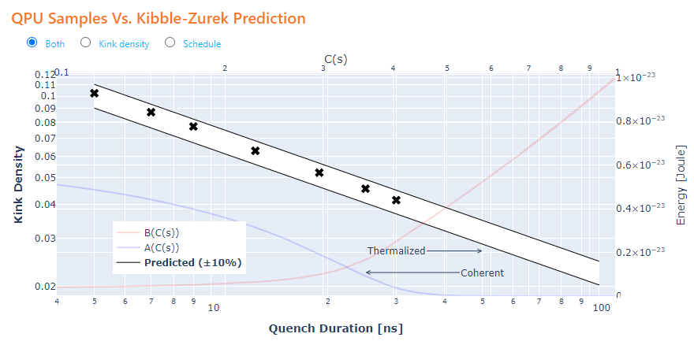

[](
  https://codespaces.new/dwave-examples/kibble-zurek-notebook?quickstart=1)

# Coherent Annealing: Kibble-Zurek Simulation on a QPU

A demonstration of using the 
[fast-anneal protocol](https://docs.dwavesys.com/docs/latest/c_qpu_annealing.html) 
on a quantum processing unit (QPU) to simulate the formation of topological defects 
in a 1D ring of spins undergoing a phase transition, as described by the 
[Kibble-Zurek mechanism](https://en.wikipedia.org/wiki/Kibble%E2%80%93Zurek_mechanism).

This example anneals an Ising problem in the coherent regime, producing results 
predicted for your configured anneal duration.



* [The Kibble-Zurek Mechanism](#The-Kibble-Zurek-Mechanism)
* [Installation](#Installation)
* [Usage](#Usage)
* [Model Overview](#Model-Overview)
* [Code](#Code)
* [License](License)

## <a name="The-Kibble-Zurek-Mechanism"></a> The Kibble-Zurek Mechanism

Everyone is familiar with macroscopic phase transitions: raise the surrounding 
temperature and solid ice transitions to liquid water, magnets become 
demagnetized. The material switches from an orderly state to a disorderly 
one: all microscopic magnetic domains aligned in the magnet and atoms arranged 
in a crystalline structure in ice to randomly oriented magnetic domains and 
constant formation and breaking of hydrogen bonds in water. 


The Kibble-Zurek mechanism relates the formation of topological defects in 
a system driven through a phase transition to the (finite) rate of that 
transition. Kibble originally formulated it to explain the transition of the 
early universe, post-Big Bang, from symmetric at its first high temperature 
state to its unsymmetric cool and expanding state.  


In the case of the universe, these symmetry-breaking defects led to the formation
of galaxies. 

Zurek expanded the idea to condensed matter. It pertains also to quantum phase 
transitions.

Consider 


## <a name="Installation"></a> Installation

You can run this example without installation in cloud-based IDEs that support 
the [Development Containers specification](https://containers.dev/supporting)
(aka "devcontainers").

For development environments that do not support ``devcontainers``, install 
requirements:

    pip install -r requirements.txt

If you are cloning the repo to your local system, working in a 
[virtual environment](https://docs.python.org/3/library/venv.html) is 
recommended.

## <a name="Usage"></a> Usage

Your development environment should be configured to 
[access Leap’s Solvers](https://docs.ocean.dwavesys.com/en/stable/overview/sapi.html).
You can see information about supported IDEs and authorizing access to your 
Leap account [here](https://docs.dwavesys.com/docs/latest/doc_leap_dev_env.html).  

To run the demo:

```bash
python app.py
```

Access the user interface with your browser at http://127.0.0.1:8050/.

The demo program opens an interface where you can configure 
problems, submit these problems to a quantum computer, and compare the results
to the Kibble-Zurek predictions.

*Hover over an input field to see a description of the input and its range of*
*supported values.*

## <a name="Model-Overview"></a> Model Overview

TBD

## <a name="Code"></a> Code

Most the code related to configuring and analyzing the Ising problem is in the
[helpers/qa.py](helpers/qa.py) and [helpers/kz_calcs.py](helpers/kz_calcs.py) 
files. The remaining files mostly support the user interface.

---
**Note:** Standard practice for submitting problems to Leap solvers is to use
a [dwave-system](https://docs.ocean.dwavesys.com/en/stable/docs_system/sdk_index.html)
sampler; for example, you typically use
[DWaveSampler](https://docs.ocean.dwavesys.com/en/stable/docs_system/reference/samplers.html)
for Ising problems. The code in this example uses the
[dwave-cloud-client](https://docs.ocean.dwavesys.com/en/stable/docs_cloud/sdk_index.html),
which enables finer control over communications with the Solver API (SAPI).

If you are learning to submit problems to Leap solvers, use a ``dwave-system``
solver, with its higher level of abstraction and thus greater simplicity,
as demonstrated in most the code examples of the
[example collection](https://github.com/dwave-examples) and in the
[Ocean documentation](https://docs.ocean.dwavesys.com/en/stable/index.html).

---

## License

Released under the Apache License 2.0. See [LICENSE](LICENSE) file.
